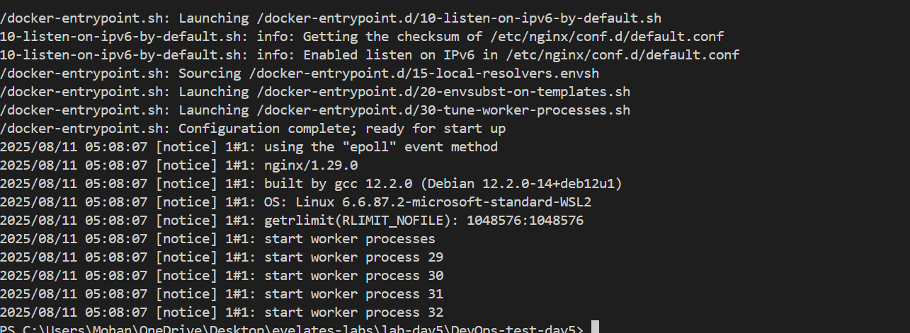

# 🚀 Kubernetes Deployment with Minikube – Task 5

This project demonstrates deploying and managing an application in Kubernetes using **Minikube**, **kubectl**, and **Docker**. It covers creating deployments, exposing services, scaling, and monitoring resources.

---

## 🎯 Objective  
Set up a local Kubernetes cluster using Minikube, deploy an application, expose it via a Kubernetes Service, scale the deployment, and verify using `kubectl`.

---

## 🛠️ Tools & Technologies  

- **Minikube** – Local Kubernetes cluster  
- **kubectl** – Kubernetes CLI tool  
- **Docker** – Containerization  
- **Nginx** – Sample application  

---

## ✅ What Was Done  

- Started a Minikube cluster  
- Created a Kubernetes deployment for Nginx  
- Created a Kubernetes service to expose the deployment  
- Verified pods and services  
- Scaled the deployment to more replicas  
- Viewed logs using `kubectl`  

---

## 📂 Kubernetes Manifests  

### **`deployment.yaml`**  
```yaml
apiVersion: apps/v1
kind: Deployment
metadata:
  name: nginx-deployment
  labels:
    app: nginx
spec:
  replicas: 2
  selector:
    matchLabels:
      app: nginx
  template:
    metadata:
      labels:
        app: nginx
    spec:
      containers:
      - name: nginx
        image: nginx:latest
        ports:
        - containerPort: 80
```

### **`service.yaml`**  
```yaml
apiVersion: v1
kind: Service
metadata:
  name: nginx-service
spec:
  type: NodePort
  selector:
    app: nginx
  ports:
    - protocol: TCP
      port: 80
      targetPort: 80
      nodePort: 30007
```

---

## 🛠️ Steps to Deploy  

### **1️⃣ Start Minikube**  
```bash
minikube start
minikube status
```
  
  

---

### **2️⃣ Apply Deployment**  
```bash
kubectl apply -f deployment.yaml
```

---

### **3️⃣ Apply Service**  
```bash
kubectl apply -f service.yaml
```

---

### **4️⃣ Verify Pods and Services**  
```bash
kubectl get pods
kubectl get svc
```
  

---

### **5️⃣ Access the Application**  
```bash
minikube service nginx-service
```

---

### **6️⃣ Scale the Deployment**  
```bash
kubectl scale deployment nginx-deployment --replicas=4
kubectl get pods
```
  

---

### **7️⃣ View Logs**  
```bash
kubectl logs <pod-name>
```
  

---

## ✅ Final Output  
- Minikube cluster started successfully  
- Nginx deployment created and running  
- Service exposed on NodePort  
- Deployment scaled to multiple replicas  
- Application verified and logs retrieved  

